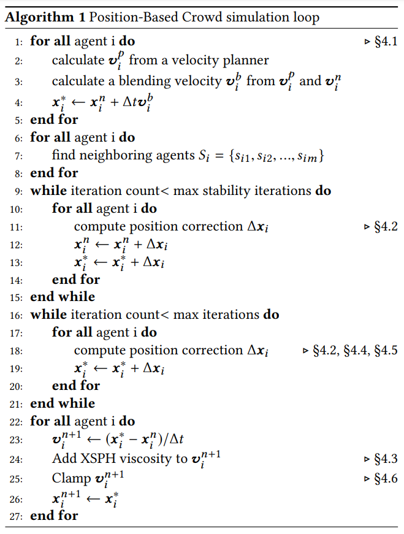

# webGPU-crowd-simulation
Weisheng Li, Yuxiao Zheng  
https://github.com/WilliamZheng27/webGPU-crowd-simulation

## Summary
We plan to implement a read-time crowd simulation algorithm using the WebGPU API

## Background
The algorithm can be broken down into five stages:

1. **Velocity Planning**: advect the agent based on a calculated velocity field.
2. **Neighbor Searching**: find the nearest neighbor and assign to hash grid.
3. **Stability Solving**: resolve any collisions that remain from the previous time step for stability.
4. **Constraint Solving**: project the main constraints and correct agents' positions.
5. **Velocity Finalizing**: finalize the velocity and update the final position of the agent

Crowd simulation algorithms require computing the velocity and updating the position of all agents
in the scene simultaneously, which creates an opportunity for parallelization. The algorithm was
originally implemented in CUDA kernels. We plan to implement it with shader programs in WebGPU instead
and measure the performance.
